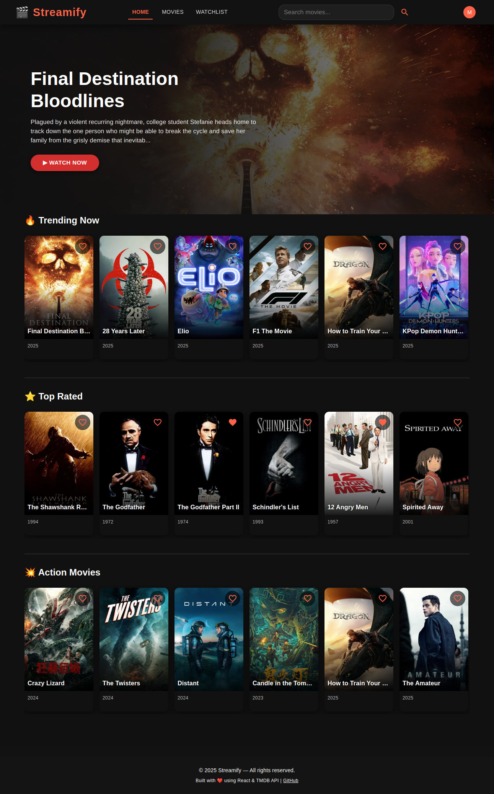

# STREAMIFY APP - Netflix-clone
Streamify is a responsive, mobile-first movie streaming web application built with React, Firebase, and TMDB API. It allows users to explore movies, view details, add to watchlist, and stream trailers — all within a sleek, Netflix-inspired interface.

## Features
🔐 Authentication with Firebase (Login / Signup)

🧑 User Profiles with persistent sessions

📽️ Movie Listings by Genre

🎞️ Detailed Movie Pages with trailers, overview, runtime, rating, and cast

❤️ Add to Watchlist (only for logged in users)

🔍 Search Movies by title or genre

📱 Responsive UI for all screen sizes (Mobile, Tablet, Desktop)

🧭 Navigation Drawer with active page highlighting and user avatar

💾 Persistent Watchlist with “Remove” and “Clear All” options

🔔 Toast Notifications and Confirmation Dialogs for interactions

🎬 See More Button for paginated genre-based movie rows

🧠 Context APIs for global auth and watchlist state management

## Tech Stack

| Tech                        | Description                                    |
| --------------------------- | ---------------------------------------------- |
| **React.js**                | Frontend UI framework                          |
| **Firebase Auth**           | Authentication and watchlist storage           |
| **TMDB API**                | Fetch movie data, genres, trailers, cast       |
| **Material-UI (MUI)**       | Responsive and accessible UI components        |
| **React Router**            | Navigation between pages                       |
| **React Context API**       | Global state management for auth and watchlist |
| **Toastify / MUI Snackbar** | Notifications and alerts                       |

## Installation

# 1. Clone the repository

git clone https://github.com/mwendwavickie/netflix-clone.git
cd netflix-clone

# 2. Install dependancies

npm install

#  3.Set up environment Variables

Create a .env file in the root folder:

touch .env

REACT_APP_TMDB_KEY=your_tmdb_api_key
REACT_APP_FIREBASE_API_KEY=your_firebase_api_key
REACT_APP_FIREBASE_AUTH_DOMAIN=your_firebase_auth_domain
REACT_APP_FIREBASE_PROJECT_ID=your_project_id
REACT_APP_FIREBASE_APP_ID=your_app_id

# Start the app 
npm start

## Future Improvements

Support for multiple user profiles

Dark/light theme toggle

Ratings and reviews system

## Contributing

Contributions are welcome! Please open an issue or pull request for improvements or bug fixes.

## License

MIT License

